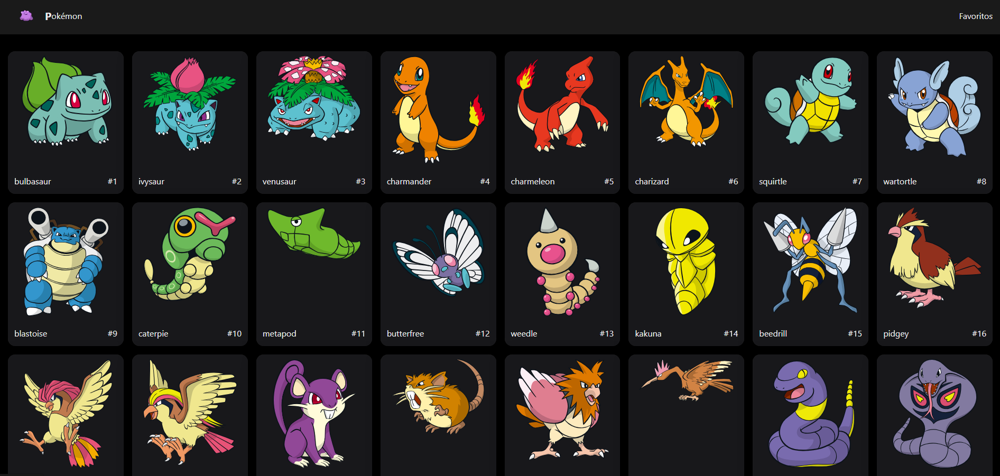

# Pokémon Next

## Descripción 📖

Aplicación con Next, realizando peticiones al API de pokémons, para los cuales se crean las páginas estaticas para cada uno de los distintos pokémons, y con la opción de guardarlos en favoritos.

## Competencias adquiridas 🎨

- Generación de páginas estaticas SSG
- Implementación libreria [NextUI](https://nextui.org/)
- Incremental Static Regeneration ISR
- Incremental Static Generation ISG

## Tecnologias utilizadas 🕹

- [NextJS](https://nextjs.org/) versión 13.4.19
- [NextUI](https://nextui.org/) versión 2.1.12
- [TailwindCSS](https://tailwindcss.com/) versión 3.3.3
